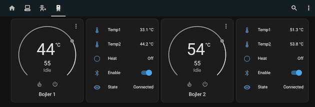

# ESPHome component for Dražice OKHE smart water heater

This ESPHome components connects to Dražice OKHE smart water heaters via Bluetooth Low Energy, collects data and also allows for limited remote control.

You will need an ESP32 module and an MQTT server. You also need to determine the MAC address of your water heater. See an [example configuration](example.yaml).

Take note that only one device can be connected to the water heater at a time.

## Documentation

This ESPHome components uses couple of standard components (sensors etc.) for easy HomeAssistant integration (auto-discovery). While it uses MQTT, it's also possible to remove MQTT and setup HA integration directly via `api:` option.

### water heater outputs

| Binary sensors | |
| --- | --- |
| HDO | On when low energy tariff is currently active |
| Heat | On when the water heater is currently heating (consuming energy) |

| Sensors | |
| --- | --- |
| Temp1  | Temperature detected by lower temp sensor. |
| Temp2  | Temperature detected by upper temp sensor (this is the temp displayed on the water heater). |
| Normal temperature | Configured target temperature in NORMAL/HDO mode |
| Energy | energy consumed since last reset (in kWh) |

| Text sensors | |
| --- | --- |
| Version | firmware version, board version and serial number |
| State |  connection state: Disconnected / Authenticating / Require PIN / Disconnected |
| Name  |  name of the water heater unit |

| Inputs | |
| --- | --- |
| Pairing PIN | input to set pairing PIN |
| Mode  |  set one of the operating modes |

### Modes

This is the list of recognized mode values. See the [original app](https://play.google.com/store/apps/details?id=cz.dzd.smartbojler&hl=cs&gl=US) for more details, but the names are self-explanatory.

| Value           | Notes                       |
| --------------- | --------------------------- |
| STOP            | cannot be set               |
| NORMAL          | can be set if hdo_enabled=0 |
| HDO             | can be set if hdo_enabled=1 |
| SMART           | can be set if hdo_enabled=0 |
| SMARTHDO        | can be set if hdo_enabled=1 |
| ANTIFROST       |                             |
| NIGHT           |                             |

Toggling mode will also enable/disable HDO based on selected mode -  NORMAL/HDO and SMART/SMARTHDO.

## Pairing process

The water heater requires the client to be "authenticated" in order to communicate. The client generates some random UUID, sends it to the water heater and the water heater responds with request for pairing and shows PIN on the display.

This component allows to set pairing PIN and complete the pairing procees from HomeAssistant.

### 1. configure ESP device

Create a configuration for ESP (see [example](example.yaml) for details). Component allows to define multiple water heaters to connect to (max 3). You need to know water heater BT MAC address (use any BT scanner to listen for BLE announcements. Please note that water heater sends announcements only when no device is connected.)

```yaml
esphome:
  name: "test-node"

esp32:
  board: nodemcu-32s
  framework:
    type: arduino

substitutions:
  mac_water_heater: XX:XX:XX:XX:XX:XX

external_components:
  - source: 
      type: git
      url: https://github.com/pedobry/esphome-smartboiler
    components: [smartboiler]

logger:
  level: info

# Enable Home Assistant API
api:
  encryption:
    key: !secret ha_API_key

ble_client:
  - mac_address: ${mac_water_heater}
    id: drazice_okhe

smartboiler:
  - ble_client_id: drazice_okhe
    temp1:
      name: "Water heater temp1"
    temp2:
      name: "Water heater temp2"
    mode:
      name: "Water heater mode"
    thermostat:
      name: "Water heater thermostat"
    heat_on:
      name: "Water heater heat"
    hdo_low_tariff:
      name: "Water heater HDO"
    pin:
      name: "Water heater PIN"
    state:
      name: "Water heater state"
    version:
      name: "Water heater version"
    b_name:
      name: "Water heater name"
    consumption:
      name: "Water heater energy"

switch:
  - platform: ble_client
    ble_client_id: drazice_okhe
    name: "Enable water heater monitoring"

ota:
  password: !secret ota_password

wifi:
  ssid: !secret wifi1_ssid
  password: !secret wifi1_psk

```

I strongly recommend adding a switch to enable/disable the monitoring. The water heater allows to connect only one device at a time and you might need to disconnect the monitoring when you want to use mobile application for some complex setting or firmware upgrade.

### 2. Pairing with PIN

Once you flash ESP32 and power it on, it will autogenerate random UUID and try to connect to the water heater. Since it's not paired yet, it will end up in `Require PIN` state (with PIN visible on water heater display). At this moment you can enter the PIN in Home Assistant and it will finish the pairing process.

> **Important:**\
> The water heater keeps PIN visible only for about 20 seconds, then it disconnects the client and the pairing process restarts. water heater generates always new PIN on each attempt. Wait for HA until it shows state `Require PIN` and only then enter the PIN.\
\
Changing/setting PIN in other states is ignored.\
Once the pairing is completed (state is `Connected`), PIN value is also ignored.

The ESP32 stores UUID in NVM and pairing is persistent between restarts.

### How to reset UUID

ESPHome NVM can be reset by:

```bash
dd if=/dev/zero of=nvs_zero bs=1 count=20480
esptool.py --chip esp32 --port /dev/ttyUSB0 write_flash 0x009000 nvs_zero
```

## Multiple water heaters on the same ESP32

It's possible to connect ESP to multiple water heaters simultaneously (up to three). See [example_multiple.yaml](example_multiple.yaml).


